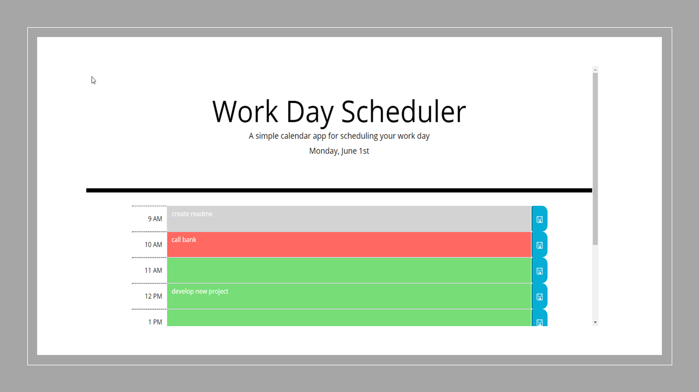
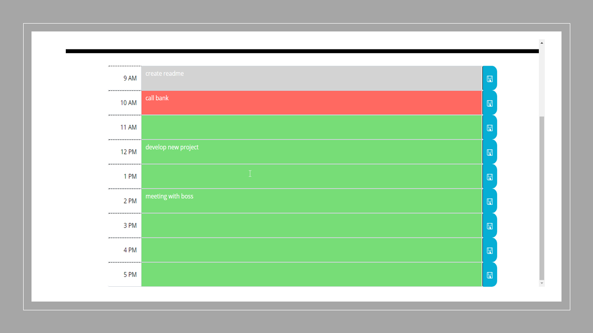

# Work Day Scheduler

## Description
A daily planner application that allows a user to save events for each business hour of the day.

## Features
* Is a simple calendar application where the current day is displayed at the top of the calendar

* After header the user is presented with time blocks for standard business hours

 

* Each time block is color-coded to indicate whether it is in the past, present, or future
* To add an event the user must click into a time block
* If the user wan to save the event have to click the save button on the right side of the time block.
* The events that user saves persist on the application.

## Built With
* HTML
* CSS
* JavaScript

## API and libraries
* Bootstrap
* moment.js
* jQuery

## Website
To visit the page go to:
https://florhaidee.github.io/work-day-scheduler/

## Contribution
Made with ❤️ by Florhaidee

### ©️2020 
